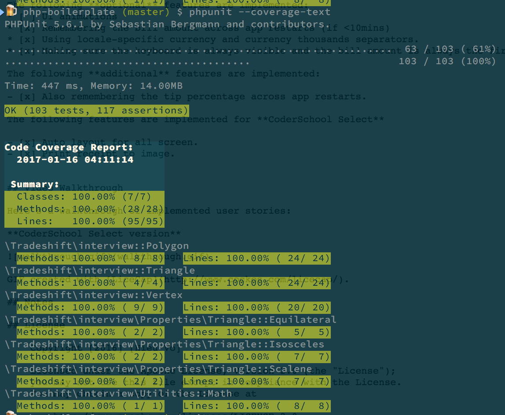

**Solution**

- Although the problem states that we should determine a triangle by edge lengths, but in geometric, defining a triangle by edge lengths is quite wierd. It should be defined by vertices. So I create Vertex class
- We didn't say clearly, if the triangle is in 2D or 3D, meanwhile 2D is just simplied case of 3D, I choose to support 3D from the beginning, a vertex will have 3 axises (x, y, z), z-axis would be 0 by default (2D).
- In the future, probably we will have to support new shapes beside Triangle, I think of a base class Polygon, which Triangle (and new shapes) will inherit.
- Each polygon will have different properties, definition and validation of properties should be separated to classes. It's more flexible for us to add more properties later. Classes Equilateral, Isosceles and Scalene were created.
    
**Test coverage**

